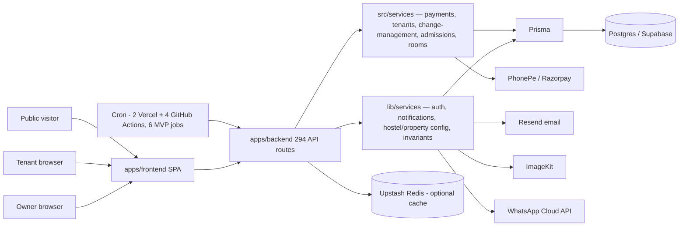

# Architecture

Related: [[Backend]] · [[Frontend]] · [[Database]] · [[APIs]] · [[README]]

This page describes the architecture as confirmed by reading `apps/backend/` and `apps/frontend/` directly (routes, services, schema) — see [[Backend]], [[Frontend]], [[Database]], [[APIs]] for the full evidence behind each claim here.

## System shape

Two live application trees plus reference/legacy trees kept for context (see [[README]] for the full table):

- **`apps/backend/`** — Next.js 14 App Router API, 294 route files, Prisma + Postgres (Supabase), ~140 service files split across `lib/services/` and `src/services/`.
- **`apps/frontend/`** — Vite + React 19 SPA, three role-scoped route trees (public/owner/tenant) plus a reserved-but-empty admin tree.

## Request flow

```
apps/frontend page
  → feature hook (useQuery / useMutation)
  → feature API wrapper (src/features/*/api, or src/domains/* where migrated)
  → Axios client (src/lib/api-client.ts)
  → apps/backend/app/api/* route handler (thin)
  → service (lib/services/ or src/services/)
  → Prisma
  → Postgres
```

Query cache keys are centralized in `apps/frontend/src/lib/queryKeys.ts` (with a `domains/payments` exception carrying its own parallel `tenantQueryKeys`, unresolved whether intentional — see [[Frontend]]). Mutations invalidate by key rather than manual refetching.

## The two backend service trees are a domain split, not legacy-vs-canonical

Confirmed by cross-import analysis (11 `lib/` files import `src/`, 17 `src/` files import `lib/` — genuinely live and mutually dependent):

- **`src/services/`** = domain **transaction/write-path business logic**: payments execution (`payments/`), tenant lifecycle (`tenants/`), change-management approval workflow, admissions, room allocation.
- **`lib/services/`** = auth, notifications (WhatsApp/email), hostel/property/portfolio config and analytics, cross-cutting invariant/reconciliation checks, and — a source of confusion — some payment-*adjacent* config/math (billing preferences, the late-fee engine primitive).

Full domain-by-domain placement table: [[Backend]].

## The frontend is mid-migration from `features/` to `domains/`

`apps/frontend/src/domains/*` is the stated target for new business logic, but today it's mostly a thin re-export shim over `src/features/*/api` — only `domains/payments` has genuinely new code. `src/features/*` remains the live, actually-used API-wrapper layer for almost everything. New frontend work should default to `features/*` unless a populated `domains/*` wrapper already exists. See [[Frontend]].

Similarly, `apps/frontend/src/portal/` (the old tenant portal) is **frozen and allowlisted** — routing ownership has moved to `src/platforms/tenant/router`, but the actual page components haven't moved yet; they still live in `src/portal/pages/*`. Both `platforms/owner/` and `platforms/tenant/` currently contribute routing/shell wiring only — real screens live in `app/components/views/*` (owner) and `src/portal/pages/*` (tenant).

## Diagram



### Diagram TODO
- [ ] Payment allocation (priority-tiered settlement) sequence diagram — see [[Business-Rules]] for the exact priority order to encode.
- [ ] Move-out state machine diagram — full transition graph is documented in [[Business-Rules]] and could be rendered directly as a Mermaid `stateDiagram-v2`.

## Auth flow ([[Decisions#ADR-031|ADR-031]], 2026-07-28)

Supabase Auth is the single identity provider; `getSession()` remains the one seam every route relies on, now resolving role/owner_id/tenant_id Node-side per request rather than trusting long-lived JWT claims (see [[Backend#Auth/session model|Backend]] for why the Custom Access Token Hook approach was rejected). Password login stays backend-mediated — the SPA never calls Supabase's password-grant endpoint directly.

```mermaid
sequenceDiagram
  participant SPA as apps/frontend SPA
  participant API as apps/backend /api/auth/login
  participant SB as Supabase Auth
  participant MW as middleware.ts (Edge)
  participant Sess as lib/auth.ts getSession()

  SPA->>API: POST /auth/login (email, password)
  API->>API: verify bcrypt password_hash, rate-limit, tenant-status checks
  API->>SB: ensureSupabaseIdentity() (JIT link/create auth.users)
  API->>SB: signInWithSupabasePassword()
  SB-->>API: access_token, refresh_token, expires_in
  API-->>SPA: {..., access_token, refresh_token, expires_in}
  SPA->>SB: supabase.auth.setSession({access_token, refresh_token})
  Note over SPA: onAuthStateChange fires → GET /auth/me hydrates AuthUser

  SPA->>MW: subsequent request, Authorization: Bearer <supabase JWT>
  MW->>MW: verifySupabaseAccessToken() via JWKS (ES256) — falls back to legacy HS256 verifyToken() if this fails
  MW->>MW: checkIdleTimeoutEdge() (Redis) — Supabase-mode only
  MW-->>API: x-auth-mode: supabase, x-auth-user-id, x-auth-session-id, ...
  API->>Sess: getSession(req)
  Sess->>Sess: resolveSupabaseSession() — profiles lookup by auth_user_id, else email; owner_id self-heal; tenant_id resolve
  Sess-->>API: AuthPayload {sub, role, email, owner_id, tenant_id, sid}
```

Google login: `supabase.auth.signInWithOAuth({provider:'google'})` → full-page PKCE redirect through Supabase directly to Google and back → SPA lands on `/auth/callback` with an ordinary Supabase session already set → calls `GET /auth/me`, which runs the same `resolveSupabaseSession()` rejection rules (`NO_STAYO_ACCOUNT`/`TENANT_GOOGLE_NOT_ALLOWED`/`ACCOUNT_DISABLED`) as password login — Google is never allowed to auto-provision a `profiles` row.

Legacy HS256 tokens (issued before this migration) are still accepted by `middleware.ts` during the dual-accept transition window and resolved by the old header-reading branch of `getSession()`; no forced logout occurs on deploy.

## Enforced architectural boundaries

Both apps have scripted invariant checks that hard-fail CI/build:

- **`apps/frontend/scripts/check-architecture.mjs`** — no raw `fetch()`/`axios` outside `@lib/api-client`; `src/portal` is frozen and allowlisted file-by-file; `src/shared` must not import from `app|platforms|portal|features|domains|services`.
- **`apps/backend/scripts/architectural-invariants-check.ts`** — 9 static checks, most notably: `hostelId` must never be optional in operational code; no "first hostel" (`hostels[0]`) fallback; settled `payments` rows are immutable (no update/delete anywhere in application code); no `$queryRawUnsafe` outside an allowlist. Full list: [[Backend]].

These exist because of **real past bugs** — the "first hostel" and required-`hostelId` rules specifically trace back to multi-hostel owners silently getting the wrong hostel's data.

## External providers

| Provider | Purpose |
|---|---|
| PhonePe / Razorpay | Payment checkout + webhooks (`src/services/payments/providers/`, `/api/webhooks/payments/razorpay` — the only HMAC-verified payment webhook confirmed in code) |
| Resend | Transactional email |
| ImageKit | Photos/documents (tenant photos, ID documents, agreement signature images) |
| WhatsApp Cloud API (Meta) | OTP, reminders, two separate bots — tenant-facing keyword commands and a much larger owner-facing conversational assistant (7180 lines) |
| Upstash Redis | Optional read acceleration/rate limiting — Postgres via Prisma remains the source of truth |
| Sanity | CMS for the public marketing site content |

## A decommissioned subsystem worth knowing about

37 backend routes (`addons*`, `billing/*`, `plans`, `subscription`, `usage`, `admin/settlements/*`, `owner/finance/*`, `owner/me/{subscription,usage,activation}`, 4 cron jobs) are intact files that unconditionally return `410 Gone`, referencing a "single-business migration." This, plus the `usage_tracking` table and a `20260517000000_decommission_saas_tables` migration, indicates the system **used to be a multi-hostel-owner SaaS product with subscription plans/add-ons**, and was deliberately narrowed to a single-business model. See [[Decisions]] and [[APIs]].

## See also
- [[Backend]] for `apps/backend/` internals
- [[Frontend]] for `apps/frontend/` internals
- [[Database]] for schema/migrations
- [[Business-Rules]] for the domain model this architecture serves
- [[Decisions]] for the architectural decisions inferred from this code
